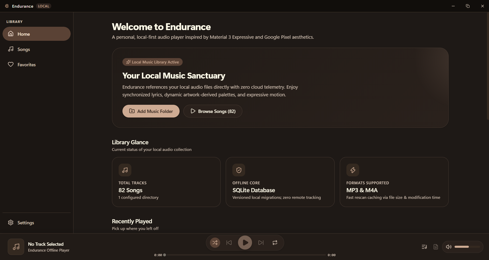
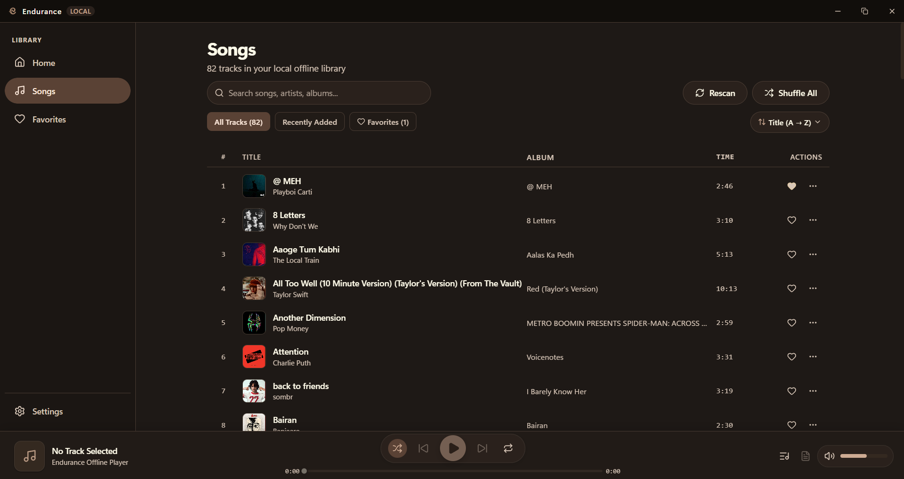

<div align="center">


# Endurance

### A premium, open-source, offline-first music player.

<p align="center">
  Beautiful local music playback. No streaming. No cloud lock-in.
</p>

<p align="center">
  <a href="https://github.com/Endurance3000/Endurance/releases/latest">
    
  </a>
  <a href="https://github.com/Endurance3000/Endurance/releases/latest">
    
  </a>
  <a href="https://github.com/Endurance3000/Endurance">
    
  </a>
  <a href="https://github.com/Endurance3000/Endurance/issues">
    
  </a>
</p>

<p align="center">
  <a href="#download"><strong>Download</strong></a> ·
  <a href="#preview"><strong>Preview</strong></a> ·
  <a href="#why-endurance"><strong>Why Endurance?</strong></a> ·
  <a href="#features"><strong>Features</strong></a> ·
  <a href="#technology-stack"><strong>Tech Stack</strong></a> ·
  <a href="#architecture"><strong>Architecture</strong></a> ·
  <a href="#building-from-source"><strong>Build from Source</strong></a> ·
  <a href="#roadmap"><strong>Roadmap</strong></a> ·
  <a href="#contributing"><strong>Contributing</strong></a>
</p>

</div>

---

## Overview

**Endurance** is a fast, elegant, and private desktop music player designed for people who want their music collection to live and play directly on their computer.

Built with **Tauri v2**, **Rust**, **React 19**, and **SQLite**, Endurance pairs high-performance local directory scanning with a warm, Material 3-inspired user interface, synchronized offline LRC lyrics, and two-state shuffle queue management.

---

## Download

### Windows (Official Release)

Download the latest version (**v0.1.0**) for Windows 10 and Windows 11 (64-bit):

[-c48b71?style=for-the-badge&logo=windows)](https://github.com/Endurance3000/Endurance/releases/latest)

#### Available Package Formats on the [Releases Page](https://github.com/Endurance3000/Endurance/releases/latest):
* **`Endurance_0.1.0_x64-setup.exe`** — Standard NSIS setup installer (*recommended for most users*).
* **`Endurance_0.1.0_x64_en-US.msi`** — Windows Installer package (*ideal for enterprise and managed environments*).

---

## Why Endurance?

* **Your Music Stays Yours** — Plays audio directly from your local filesystem without moving, altering, or re-encoding your files.
* **Offline-First by Design** — No cloud accounts, remote servers, streaming lock-in, or telemetry. Every installation is self-contained.
* **Warm, Expressive Interface** — Built on Material 3 design principles with dynamic color extraction from album art, smooth transitions, and an organic sine-wave playback scrubber.
* **Lightweight & Fast** — Powered by a multi-threaded Rust backend with a local SQLite database that starts quickly and uses minimal system resources.
* **Open & Transparent** — Built with modern open-source technologies with a clear codebase open to community contributions.

---

## Preview

### Homepage
*Recent tracks, listening statistics, and quick navigation across your collection.*

<p align="center">
  
</p>

### Library View
*Fast local collection browsing with instant search, multi-field sorting, and album artwork.*

<p align="center">
  
</p>

### Player — Light Theme
*Full player view with synchronized LRC lyrics and ambient album art tonal colors.*

<p align="center">
  
</p>

### Player — Dark Theme
*Immersive dark mode with expressive sine-wave scrubbing and active line lyric emphasis.*

<p align="center">
  
</p>

---

## Features

### 📁 Library & File Management
* **Folder-Based Indexing** — Add one or more music directories; files are scanned and indexed recursively.
* **Fast Metadata Extraction** — Uses pure Rust [`lofty`](https://crates.io/crates/lofty) to read ID3v1/v2 and MP4/ILST tags (title, artist, album, album artist, genre, year, track number, disc number).
* **Album Artwork Caching** — Embedded pictures are extracted, hashed via SHA-256, and cached locally on disk.
* **Deterministic Track Identity** — Tracks receive stable IDs derived from canonical paths, preserving favorites, history, and play counts across restarts.
* **Graceful Missing-File Handling** — If a storage drive is disconnected, tracks remain safely marked as unavailable rather than removed from your database.

### 🎵 Audio Engine & Playback
* **Native Audio Pipeline** — Centralized audio pipeline utilizing custom Tauri asset streaming and hardware-accelerated Web Audio / HTML5 Audio decoding.
* **Supported Audio Formats** — High-fidelity playback for **MP3** (`.mp3`) and **M4A / AAC / ALAC** (`.m4a`).
* **Expressive Wave Slider** — An animated sine-wave progress scrubber that dynamically pulses with playback, supporting pointer scrubbing, bounds clamping, and keyboard seeking.
* **Volume & Mute Control** — Accurate linear volume slider with automatic local state persistence.

### 🔀 Queue & Two-State Shuffle
* **Smart Queue Drawer** — Add songs, insert tracks via "Play Next", remove upcoming songs, or clear the queue.
* **Fluid Pointer Reordering** — Reorder tracks with a custom Pointer Events capture system designed for reliable desktop interaction.
* **Two-State Shuffle System**:
  * **Shuffle OFF** — Restores your upcoming queue to alphabetical library order while keeping the currently playing track active.
  * **Shuffle ON** — Generates a fresh, mathematically guaranteed Fisher-Yates random sequence with zero duplicate plays within a cycle.
* **Repeat Modes** — Cycle through Repeat Off, Repeat One (loop current track), and Repeat All (loop queue).

### 📜 Synchronized Offline Lyrics
* **Automatic Local Discovery** — Automatically detects `.lrc` lyric files located in the same folder as the audio track.
* **Robust Encoding Support** — Decodes UTF-8 (with or without BOM), UTF-16 LE, and UTF-16 BE files.
* **Interactive Seeking** — Synchronized active line highlighting with past/future lyric fading; click any lyric line to jump audio playback directly to that timestamp.
* **Untimed Lyrics Fallback** — Clean typographic presentation for plain text lyrics without timestamps.

### 🎨 Themes & Design System
* **Curated Appearance Modes** — Switch between **Dark**, **Light**, and **System** themes.
* **Dynamic Artwork Palette** — Automatically extracts dominant colors from album artwork to apply subtle, harmonious color accents across the interface.
* **High Contrast Mode** — Built-in accessibility theme featuring solid borders, high contrast ratios, and clear focus indicators.

### 📊 Local History & Favorites
* **Playback History** — Automatically logs completed listening sessions to SQLite after 15 seconds or 30% playback duration (recorded once per session).
* **One-Click Favorites** — Mark favorite tracks instantly with indexed database querying for rapid filtering.

---

## Offline & Privacy Architecture

Endurance is built from the ground up as an **offline-first local desktop application**:

* **Local Storage** — Your music library, playback history, favorites, and preferences are stored exclusively on your machine in a local SQLite database (`endurance.db`).
* **Isolated User Data** — Database files and artwork caches are placed in your standard OS application data directory (`%APPDATA%\com.endurance.player\`), ensuring application updates never overwrite your listening data.
* **No Network Dependency** — The core application requires no internet connection to scan, index, organize, or play your music library.

---

## Technology Stack

Endurance is built with an efficient, modular stack:

| Component | Technology | Purpose |
| :--- | :--- | :--- |
| **Desktop Shell** | [Tauri v2](https://tauri.app/) | Secure, lightweight native window and system bridge |
| **Native Core** | [Rust](https://www.rust-lang.org/) | Multi-threaded file scanner, IPC handlers, and tag processing |
| **Local Database** | [SQLite](https://sqlite.org/) via [`rusqlite`](https://crates.io/crates/rusqlite) | Local relational storage with WAL mode and versioned migrations |
| **Audio Metadata** | [`lofty`](https://crates.io/crates/lofty) | Fast, pure Rust audio container and tag parser |
| **Frontend Framework** | [React 19](https://react.dev/) + [TypeScript](https://www.typescriptlang.org/) | Type-safe UI components and reactive state management |
| **Build Tooling** | [Vite 6](https://vitejs.dev/) | Development server and production frontend bundler |
| **Icons & UI** | [Lucide React](https://lucide.dev/) | Clean, consistent interface iconography |

---

## Architecture

```text
┌─────────────────────────────────────────────────────────────┐
│                    REACT 19 FRONTEND                        │
│   Pages • PlaybackContext • ThemeContext • WaveSlider       │
└──────────────────────────────┬──────────────────────────────┘
                               │
                       Tauri IPC Bridge
                               │
┌──────────────────────────────┴──────────────────────────────┐
│                    RUST TAURI BACKEND                       │
│   commands.rs • LibraryScanner • LoftyMetadataReader        │
└──────────────────────────────┬──────────────────────────────┘
                               │
            ┌──────────────────┴──────────────────┐
            ▼                                     ▼
┌───────────────────────┐             ┌───────────────────────┐
│   LOCAL SQLITE DB     │             │  LOCAL FILESYSTEM     │
│  tracks • folders     │             │  Music Directory      │
│  history • prefs      │             │  Artwork Cache (.bin) │
└───────────────────────┘             └───────────────────────┘
```

---

## Installation & Getting Started

### For End Users (Windows)

1. Open the [**Latest Release**](https://github.com/Endurance3000/Endurance/releases/latest) page.
2. Download `Endurance_0.1.0_x64-setup.exe` (or the `.msi` package).
3. Run the installer and launch **Endurance**.
4. Click **Add Music Folder** (or navigate to **Settings → Library**) to select your local music folder.

---

## System Requirements

* **Supported Operating System**: Windows 10 / Windows 11 (64-bit)
* **Web Runtime**: [Microsoft Edge WebView2](https://developer.microsoft.com/en-us/microsoft-edge/webview2/) (included by default on modern Windows)
* **Disk Space**: ~30 MB for application installation

*(Note: macOS support is in preparation and planned for a future release.)*

---

## Building from Source

### Prerequisites

* [Node.js](https://nodejs.org/) (v18.0.0 or higher)
* [Rust](https://www.rust-lang.org/tools/install) (stable toolchain)
* [C++ Build Tools](https://visualstudio.microsoft.com/visual-cpp-build-tools/) (MSVC toolchain on Windows)

### 1. Clone the Repository

```bash
git clone https://github.com/Endurance3000/Endurance.git
cd Endurance
```

### 2. Install Dependencies

```bash
npm install
```

### 3. Run Development Build

Start the Vite development server and the Tauri native window with hot module replacement:

```bash
npm run tauri dev
```

### 4. Run Test Suites

```bash
# Run frontend unit tests (Node.js test runner)
npm test

# Run Rust unit tests
cd src-tauri
cargo test
cd ..
```

### 5. Build Production Binaries

Compile the release executable and generate the Windows installers:

```bash
npm run tauri build
```

The output artifacts will be placed in:
* `src-tauri/target/release/bundle/nsis/` (`.exe` installer)
* `src-tauri/target/release/bundle/msi/` (`.msi` installer)
* `src-tauri/target/release/endurance.exe` (standalone executable)

---

## Project Structure

```text
Endurance/
├── branding/                 # Logo master assets and brand guidelines
├── public/                   # Static web assets (favicon, app logo)
├── src/                      # React frontend application
│   ├── animations/           # Keyframe transitions and motion definitions
│   ├── components/           # UI components (Common, Library, Player, Queue, Sidebar)
│   ├── pages/                # Main application views (Home, Songs, Favorites, Settings)
│   ├── services/             # AudioEngine, historyService, preferencesService
│   ├── state/                # PlaybackContext, ThemeContext
│   ├── themes/               # CSS tokens, color palettes, high-contrast styles
│   └── types/                # Core TypeScript definitions
├── src-tauri/                # Rust native desktop layer
│   ├── src/
│   │   ├── artwork/          # Artwork caching and SHA-256 storage
│   │   ├── db/               # SQLite connection, queries, and migrations
│   │   ├── lyrics/           # LRC discovery, parser, and BOM decoding
│   │   ├── metadata/         # Audio container tag extraction via Lofty
│   │   ├── models/           # Shared Rust data models
│   │   ├── scanner/          # Recursive file traversal and indexing
│   │   ├── commands.rs       # Tauri IPC command definitions
│   │   └── lib.rs            # Application builder and setup
│   ├── icons/                # Multi-resolution application icons
│   └── tauri.conf.json       # Tauri window and bundle configuration
├── package.json              # Frontend scripts and dependencies
└── tsconfig.json             # TypeScript compiler configuration
```

---

## Supported Formats

| Format | Extension | Tagging Standard | Supported Features |
| :--- | :--- | :--- | :--- |
| **MP3** | `.mp3` | ID3v1, ID3v2.3, ID3v2.4 | Playback, Tag extraction, Embedded artwork, LRC sync |
| **M4A** | `.m4a` | MP4 iTunes Metadata (ILST) | AAC / ALAC playback, Tag extraction, Embedded artwork, LRC sync |

---

## Roadmap

### Completed (v0.1.0)
- [x] Recursive local music folder scanner and metadata indexing
- [x] Hardware-accelerated audio engine for MP3 and M4A
- [x] Synchronized offline LRC lyrics parser with click-to-seek
- [x] Two-state shuffle engine and drag-and-drop queue management
- [x] Dynamic artwork color extraction and warm Material 3 design system
- [x] Persistent SQLite database with automated versioned migrations
- [x] Windows NSIS and MSI packaging with embedded application icons

### Planned (v0.2.0+)
- [ ] Cross-platform macOS support (universal `.dmg` bundle with native window styling)
- [ ] User-created custom playlists and playlist management
- [ ] Expanded audio container support (FLAC, OGG, WAV)
- [ ] Integrated release update notifications

---

## Contributing

Contributions from the open-source community are welcome.

### Contribution Workflow

1. **Fork** the repository on GitHub.
2. **Create a Feature Branch**:
   ```bash
   git checkout -b feature/your-feature-name
   ```
3. **Commit your changes**:
   ```bash
   git commit -m "feat: describe your change"
   ```
4. **Run Verification**:
   ```bash
   npm test
   npx tsc --noEmit
   cd src-tauri && cargo test && cd ..
   ```
5. **Open a Pull Request** explaining the intent and testing approach.

### Guidelines
* Keep pull requests focused on a single feature or bug fix.
* Maintain the existing offline-first design and avoid introducing unnecessary external dependencies.
* Ensure both frontend and Rust tests pass before opening a PR.

---

## Issue Reporting & Support

If you encounter a bug or have a suggestion:

* Open an issue on the [**GitHub Issues**](https://github.com/Endurance3000/Endurance/issues) tracker.
* In bug reports, please include:
  * Endurance version (e.g., `v0.1.0`)
  * Windows OS version (e.g., Windows 11 23H2)
  * Audio file format (e.g., MP3 / M4A)
  * Steps to reproduce the issue and observed vs. expected behavior

---

## Releases

* [**Latest Release (v0.1.0)**](https://github.com/Endurance3000/Endurance/releases/latest)
* [**All Releases**](https://github.com/Endurance3000/Endurance/releases)
* [**The New Version is under development**]
* [**Feel free to suggest the features to be added in the new version**]

---

## License

Endurance is currently being prepared as an open-source project. A formal open-source license will be established in the repository root before accepting external contributions under a defined license.

---

<div align="center">
  <sub>Made with care for people who still own their music.</sub><br>
  <strong>Endurance — Local music, beautifully played.</strong>
</div>
